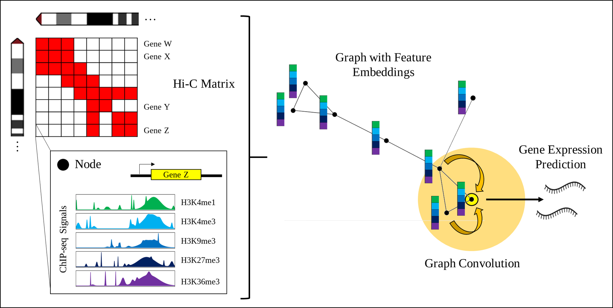

# Graphical 5hmC Convolutional Network (GhmCN)

<!--  -->
<details>
  <summary>To Dos</summary>
  
  - ~~Bash script to integrate rna-seq into rnaseq.csv registry~~
  - ~~child issue: add Rscript that TPM-normalizes~~
  - Add example data from feature counts
  - ~~Add example code to perform rna-seq integration~~
  - ~~Add code that transforms `BAM` enrichment files into binned signal of interest~~
  - ~~Child issue: Rscript that generates the ROIs from given Hi-C data~~
  - ~~Add script and explanaiton about how to transform ice-normalized Hi-C data into accessible data for script~~
  - ~~child issue: all the bunch of required scripts~~
  - Add note to please add following required `R packages` if using the auxiluary functions.
</details>

## TOC
- [Intro](#intro)
- [Conda Environment](#1-conda-environment)
- [Data Preparation](#2-data-preparation-from-stratch-hic-pro-bam-and-featurecounts-outputs)
   - [Hi-C](#21-hi-c)
   - [RNA-seq](#22-featurecounts)
   - [ChIP-like](#23-bam-enrichment-files)
- [Running the code](#3-running-the-code)
- [Citation](#4-citing-our-work)


## Intro
GhmCN uses the graph structure from [GC-merge](https://www.biorxiv.org/content/10.1101/2020.11.23.394478v3), a tool able to integrate both enrichment signal with spatial genomic information to predict gene expression. Our implementation is broadly detailed in [our bioRxiv](https://www.biorxiv.org). If you use our implementation [cite us](#4-citing-our-work) and please kindly cite the work of [_Bigness et al_](http://biorxiv.org/lookup/doi/10.1101/2020.11.23.394478).

In this repository, we provide our conda environment, six main programs (two with core classes and 4 for data processing), tar.gz processed example datasets that can be used to test the code(CD4 Naive T cells and B cells with 72h stimulation of LPS and IL4); and utility functions to pre-process the required inputs: output of [Hi-C-Pro](https://github.com/nservant/HiC-Pro), enrichment signal from `BAM` files and output of `featureCounts` into the `rnaseq.csv` file registry. All of these processed files are required to make use of our GCN, but you can derive your own input files following the appropriate formatting.

> **Before testing**:
> 
> Please `untar` the `data.tar.gz` folder after cloning the repo to test the code
> 
> The `data` folder contains 
> - two example datasets: `B72_CMS_10000bp` and `Naive_CD4T_CMS_10000bp`
> - `rnaseq.csv` file required to flag genes as On/Off
> - `gene_coords.csv` file used for plotting the graph representations

## 1. Conda Environment
We used conda and a CUDA-able (NVIDIA GPU) environment for our work. Please use the `ghmcn_env.yml` file to replicate our working environment.
If you have issues try starting with the lightweight version of the yaml `ghmcn_env-lightweight.yml`
```
conda env create -f ghmc_env.yml
# lightweight yml:
conda env create -f ghmcn_env-lightweight.yml
```

## 2. Data Preparation
In this section we describe the characteristics of the required input files and a guide for data preparation from `HiC-Pro`, `BAM` and `featureCounts` outputs.
### 2.1. `Hi-C`
The code requires the DNA interaction maps to be of an specific format: divided in files by chromosomes and having the second column as the leading coordinate.

**Example for chr1.txt**
```
3000000	3010000	12.5
3010000	3020000	10.3
...
12010000	12020000	0.3

```
The **ice-normalized output** from [Hi-C-Pro](https://github.com/nservant/HiC-Pro) requires heavy reformatting to achieve this simpler structure (ice-normalized data is shown as a 3-row file with thousands of columns). We added a set of auxiliary scripts to ease the reformatting. These aux fucntions/scripts make use of `Perl` and `R` languages, if you would use them _please make sure you have the required `R` packages listed at the bottom of the page._

```
# Assume your ice-normalized data is under
ice_normalized=/usr/data/hic_results/matrix/ABCcelltype/iced/10000/ABCcelltype_10000_iced.matrix
raw_data=/usr/data/hic_results/matrix/ABCcelltype/iced/10000/ABCcelltype_10000_abs.bed

# And output to be directed to 
output_reformat=/usr/data/output/ABCcelltype_10000_iced.txt

#Then run out auxiliary function as
./utils/Rice_C.sh $ice_normalized $raw_data $output_reformat
```
In general terms these set of function does:
- Dividing iced data per row (to individual files) and make each column a single row.
- Run R's script to force float conversion (to conserve data as `float` otherwise gets lost).
- Catenate columns-files.
- Paste columns into single file.
- run Perl's `HiC_Pro2Readable.pl` to generate the required file from the parsed data.
- Separate by chromosome and store them under `src/data/CellType`


### 2.2. `featureCounts`
This section covers the case where the user obtained count signal per gene for gene expression assessment using [`featureCounts`](https://rnnh.github.io/bioinfo-notebook/docs/featureCounts.html). This is the case where the output file has 7+ columns where the 1st, 6th and 7th column are extracted for gene expression. The `AddCellExpression.sh` shell script will run the `FeatureCounts2TPM.R` Rscript to normalize the raw `featureCounts` counts. These then TPM-normalized counts are integrated into the expression file under `src/data/rnaseq.csv` file, used by the main scripts.

Having the `featureCounts` output, it is as easy as to run our auxiliary script as follows to integrate expression data into the main expression file:
```
celltype_name=ABCcelltype
expression_file_path=/usr/data/rna_results/ABCcelltype_featureCounts.txt
./utils/AddCellExpression.sh $celltype_name $expression_file_path
```
**NOTE**: if the `celltype_name` is already present in the `src/data/rnaseq.csv` file, it will not be overwritten nor duplicated.
Running this script will end in notifying the user about the presence of such cell type.

### 2.3. `BAM` Enrichment files
> Pre-formatting the `Hi-C` data is a requirement to obtain the 5hmC (or any other) enrichment signal per bin, since we use the Hi-C-covered coordinates as the regions of interests (ROI) to extract the enrichment signal from them.
1. To collect the cell-specific signal for a set of genomic interactions, we first need to delimit the ROIs. 
   - This step makes use of the script `Generate_ROIs.sh` that will take the `Start` and `End` of coverage per chromosome for a given cell type.
   ```
   # Usage:
   Generate_ROIs.sh celltype_name
   ```
   - This will generate the appropriate `Rdata` file within the appropriate `celltype_name` folder under `src/data` to be used by other helper functions
   - **IMPORTANT:** Make sure you consistently use the same `celltype_name` across the `Hi-C`, `rnaseq.csv` and expression data.
2. Now we can pull the enrichment signal out of these cell-specific ROIs.
   - We will use of the Rscript `Collect_Count_Signal_CellSpecific.R` that takes 4 positional arguments: 
     1. `BAM` file path
     2. Condition name (as CMS or INPUT in our case, yours may vary if not using 5hmC)
     3. `OUTDIR`, this must be `src/data/celltype_name`. I did not find a reliable way within an Rscript to find its own script location (even asking (`chatGPT`)[https://chat.openai.com/chat] ;) ) to automate this.
     4. `celltype_name`. **IMPORTANT:** Has to match that under `src/data` folders
     ```
     # Usage:
     Collect_Count_Signal_CellSpecific.R \
       /usr/data/bam_results/ABCcelltype_5hmCenrichment.bam \
       CMS \
       /path/to/this/repo/src/data/celltype_name \
       celltype_name
     ```
   - This will populate the `celltype_name` data folder with the required signal for the mark "CSM"
   - Repeat for all of the different marks you intent to analyze.

## 3. Running the code
Run the program on the command line from the src direcotry. For instance: 
```
python run_models_EGA.py -c B72 -rf 1
```

This will run our model for the cell line E116 and for the regression task. The inputs to these flags can be changed so that the model can run for different cell lines as well as for either classification or regression. Please see the documentation in the run_models_.py file for additional flag options.

## 4. Citing our work
ToDo

## R packages used
- GenomicRanges
- GenomicAlignments
- stringr