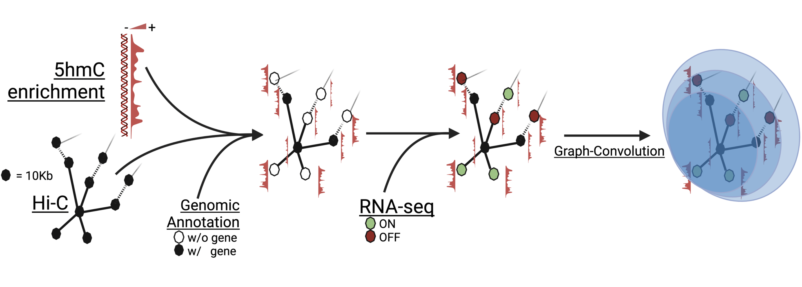

# Graph 5hmC Convolutional Network (GhmCN)

<details>
  <summary>To Dos</summary>
  
  - ~~Bash script to integrate rna-seq into rnaseq.csv registry~~
  - ~~child issue: add Rscript that TPM-normalizes~~
  - Add example data from feature counts
  - ~~Add example code to perform rna-seq integration~~
  - ~~Add code that transforms `BAM` enrichment files into binned signal of interest~~
  - ~~Child issue: Rscript that generates the ROIs from given Hi-C data~~
  - ~~Add script and explanaiton about how to transform ice-normalized Hi-C data into accessible data for script~~
  - ~~child issue: all the bunch of required scripts~~
  - Add note to please add following required `R packages` if using the auxiluary functions.
  - Need to make the R libraries part of the conda installation.
    - Has unfortunate errors.
</details>



## TOC
- [Intro](#intro)
- [1. Conda Environment](#1-conda-environment)
   - [R packages](#11-r-packages-used)
- [2. Data Preparation](#2-data-preparation)
   - [Hi-C](#21-hi-c)
   - [RNA-seq](#22-featurecounts)
   - [ChIP-like](#23-bam-enrichment-files)
- [3. Running the GCN](#3-running-the-code)
- [4. GNNExplainer Visualization](#4-running-gnnexplainer-visualizing-results)
- [6. Citation](#5-citing-our-work)


## Intro
GhmCN uses the graph structure from [GC-merge](https://www.biorxiv.org/content/10.1101/2020.11.23.394478v3), a tool able to integrate both enrichment signal with spatial genomic information to predict gene expression. Our implementation is broadly detailed in [our bioRxiv](https://www.biorxiv.org). If you use our implementation [cite us](#4-citing-our-work) and please kindly cite the work of [_Bigness et al_](http://biorxiv.org/lookup/doi/10.1101/2020.11.23.394478).

In this repository we provide our conda environment, six main programs (two with core classes and 4 for data processing), our Zenodo deposit `tar.gz`'s with raw and processed example datasets, and utility functions to pre-process the required inputs: genomic contacts, gene expression and genomic enrichment profiles. Each of these can be obtained (but not limited to) from the output of [Hi-C-Pro](https://github.com/nservant/HiC-Pro), enrichment signal from `BAM` files and output of `featureCounts`. All of these processed files are required to make use of our GCN, but you can derive your own input files following the appropriate formatting.

> **Before testing**:
> 
> Download and decompress the `B72_and_Naive_CD4T_examples.tar.gz` folders under `src/data/` to test the code with our processed datasets.
> 
> This tarball contains two example datasets, one in each folder:
> - `B72`: B cells stimulated with LPS and IL4 for 72h
> - `Naive_CD4T`: Naïve CD4 Single Positive T cells

## 1. Conda Environment
We used conda and a CUDA-able (NVIDIA GPU) environment for our work. Please use the `ghmcn_env.yml` file to replicate our working environment.
If you have issues try starting with the lightweight version of the yaml `ghmcn_env-lightweight.yml`
```
conda env create -f ghmc_env.yml
# lightweight yml:
conda env create -f ghmcn_env-lightweight.yml
```
### 1.1 R packages used
- GenomicRanges
- GenomicAlignments
- stringr

> **NOTE** 
> 
> The reason why this section was made was because during the production of this readme I was having issues incorporating `R` and its packages into my environment. I had used an `R` that I installed out of the environemt and I wanted to incorporated into the _GhmCN_ environment, but conda installing them just gets stuck in `Solving environment` and then suddently exits:
> ```
> $ conda install -c conda-forge r-base
> Collecting package metadata (current_repodata.json): done
> Solving environment: / (GhmCN)
> $ 
> ```

## 2. Data Preparation
In this section we describe the characteristics of the required input files and a guide for data preparation from `HiC-Pro`, `BAM` and `featureCounts` outputs. Under this [Zenodo deposit](https://zenodo.org/deposit/7497540) we provided an example dataset (**`example_raw_data.tar.gz`**) for Naïve B cells (`B00` codename as used in our publication) that contains the following:
- `_abs.bed` and `_iced.matrix` outputs from HiC-Pro,
- Mapping results of CMS IP `_IP.bam` and CMS INPUT `_INPUT.bam`, and 
- `_featureCounts.txt` outputs from using `featureCounts`.

> *Beware that the uncompressed size of this archive is **73G**.*

### 2.1. `Hi-C`
The code requires the DNA interaction maps to be of an specific format: divided in files by chromosomes (e.g. `hic_chr1.txt`, ..., `hic_chrN.txt`) and having the second column as the leading coordinate.

**Example input from our `Naive_CD4T`'s `hic_chr1.txt`**
```
3000000 3000000 49.9945577453461
3010000 3000000 51.25039943757
3020000 3000000 24.852610473894
...
195360000 195360000 35.0175818484145
195370000 195360000 82.6174691895984
195370000 195370000 77.7522404318486
```
The **ice-normalized output** from [Hi-C-Pro](https://github.com/nservant/HiC-Pro) requires heavy reformatting to achieve this simpler structure. ice-normalized data are 3-row files with thousands of columns where the coordinate (1st and 2nd row) is written in scientific notation. The third row contains the normalized contact information. We added a set of auxiliary scripts to ease the reformatting from 3xN to Nx3 matrices. We understand that an option was to load the matrix as a whole, transpose it and store back but we hit memory limitations in multiple instances and tries. These aux functions/scripts make use of `Perl` and `R` languages. Before proceeding with th eexample below, decompress `example_raw_data.tar.gz` from our [Zenodo deposit](https://zenodo.org/deposit/7497540) inside `GhmCN/example`.
```
ice_normalized=./example/raw_data/hic/B00_10000_iced.matrix
reference_matrix=./example/raw_data/hic/B00_10000_abs.bed
celltype_name=B00

# Run our auxiliary function as
./utils/Rice_C.sh $ice_normalized $reference_matrix $celltype_name
```
In general terms what this function does step-wise is:
- Divide iced data per row into three individual files.
- Furhter divide in individual files (each with 1000000 coordinates) for easier processing.
- Run a self-made R script to sequentially load these subfiles and eliminate scientific notation.
- Merge cleaned files
- Paste columns into single file.
- run Perl's `HiC_Pro2Readable.pl` to generate the reformatted file from the parsed data.
- Separate by chromosome and store them under `src/data/CellType`


### 2.2. `featureCounts`
This section covers the case where the user obtained count signal per gene for gene expression assessment using [`featureCounts`](https://rnnh.github.io/bioinfo-notebook/docs/featureCounts.html). This is the case where the output file has 7+ columns where the 1st, 6th and 7th column are extracted for gene expression. The `AddCellExpression.sh` shell script will run the `FeatureCounts2TPM.R` Rscript to TPM normalize the raw `featureCounts` counts. These normalized counts are integrated into the expression file under `src/data/rnaseq.csv` file, used by the main scripts.

**Example input from our `Naive_CD4T`'s expression data insisde the `src/data/rnaseq.csv` file**
```
gene_id,...,Naive_CD4T,...
Xkr4,...,0,...
Rp1,...,0,...
Sox17,...,0,...
...
Gm20806,...,0,...
Gm20854,...,0,...
Erdr1,...,2.898,...
```

Having the `featureCounts` output, it is as easy as to run our auxiliary script as follows to integrate expression data into the main expression file:
```
celltype_name=B00
expression_file_path=./example/raw_data/rna/B00_featureCounts.txt

# Run our auxiliary function as
./utils/AddCellExpression.sh $celltype_name $expression_file_path
```
**NOTE**: if the `celltype_name` is already present in the `src/data/rnaseq.csv` file, it will not be overwritten nor duplicated.
Running this script will end in notifying the user about the presence of such cell type.

### 2.3. `BAM` Enrichment files
> Pre-formatting the `Hi-C` data is a requirement to obtain the 5hmC (or any other) enrichment signal per bin, since the scripts below makes use of the `hic_chr1.txt`, ..., `hic_chr19.txt` coordinates to generate the regions of interests (ROI) to extract the enrichment signal from them.
1. To collect the cell-specific signal for a set of genomic interactions, we first need to delimit the ROIs. 
   - This step makes use of the script `Generate_ROIs.sh` that will take the `Start` and `End` of coverage per chromosome for a given cell type.
   ```
   celltype_name=B00

   # Run our auxiliary function as
   ./utils/Generate_ROIs.sh $celltype_name
   ```
   - This will generate the appropriate `Rdata` file within the appropriate `celltype_name` folder under `src/data` to be used by other helper functions
   - **IMPORTANT:** Make sure you consistently use the same `celltype_name` across the `Hi-C` and `rnaseq.csv` processing steps.
2. Now we can pull the enrichment signal out of these cell-specific ROIs.
   - We will make use of the Rscript `Collect_Count_Signal_CellSpecific.R` that takes 4 positional arguments: 
     - `BAM` file path
     - Enrichment condition name (as CMS or INPUT in our case, yours may vary if not using 5hmC; e.g. `T53ChIP`)
     - `celltype_name`. **IMPORTANT:** Has to match a `src/data/` subfolder.
     - `OUTDIR`: **this must be `src/data/celltype_name`**. 
        - I did not find a reliable way within an `Rscript` to find its own script location (even asking [`chatGPT`](https://chat.openai.com/chat) ;-) ) to automate this.
     ```
     bam=./example/raw_data/cms/B00_CMS_IP.bam
     condition=CMS
     celltype_name=B00
     outdir=./src/data/${celltype_name}

     # Run our auxiliary function as
     ./utils/Collect_Count_Signal_CellSpecific.R $bam $condition $celltype_name $outdir 
     ```
   - This will populate the `celltype_name` data folder with the required signal for the mark "CSM"
   - Repeat for all of the different marks you intent to analyze/integrate (e.g. with the INPUT enrichment we provided).

**Example input from `./src/data/Naive_CD4T/chr1_10000bp_CMSIP.count`, our `Naive_CD4T`'s 5hmC enrichment file**
```
chr1    3000000 3010000 250
chr1    3010000 3020000 225
chr1    3020000 3030000 222
...
chr1    195340000       195350000       236
chr1    195350000       195360000       44
chr1    195360000       195370000       202
```

## 3. Running the Two Main Codes
First run `process_inputs_EGA.py` on the command line from the `src` directory. After completion you are ready to train your network using `run_models_EGA.py`.  For instance: 
```
cd ./src
python process_inputs_EGA.py -c B00 -rf 0

# wait (est. 30-40 mins)
python run_models_EGA.py -c B00 -rf 0
```

This will run the model for the `B00` cell type using the classification task. The inputs to these flags can be changed so that the model can run for different cell lines (`-c`) as well as for either classification (`-rf 0`) or regression (`-rf 1`). Check inside each script for additional flag options.

## 4. Running GNNExplainer (Visualizing Results)
After the models have been trained, and the scores reported, you can run our expanded implementation of [`GNNExplainer`](https://arxiv.org/abs/1903.03894). You can select an specific node (`-n`) you want explained or can provide a gene name (`-gn`) of interest, excluding genes located in chrX, chrY and chrM.

```
python ./src/GNNExplainNode.py \
  --UsePredExp \
  -od ./src/data/Nodes_Explained/Top10 \
  -ep 1500 \
  -rf 0 \
  -hm 2 \
  -cr 10000 \
  -df data \
  --DrawWeight \
  --DrawCoords\
  -mt ./src/data/Naive_CD4T_CMS_10000bp/saved_runs/model_2021-11-29-at-21-23-15.pt \
  -mo Naive_CD4T \
  -c Naive_CD4T 
```


## 5. Citing our work
ToDo